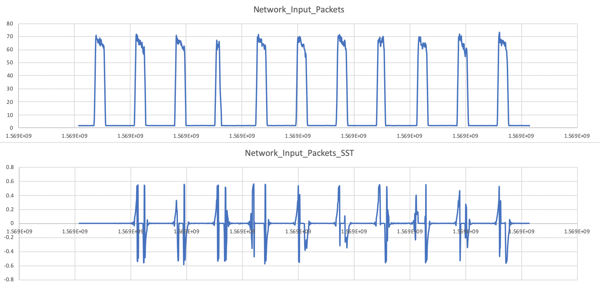
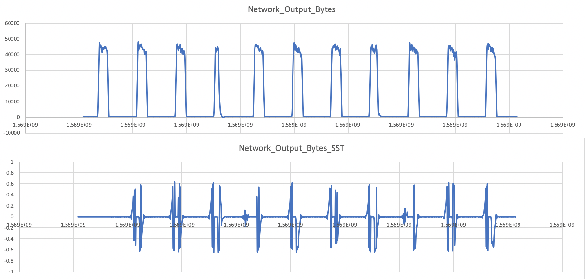

#性能指标分析

[TOC]

## 1. 背景

​		在知识图谱项目中，记录有大量的**性能指标时序数据**和**事件数据**，分析判断这些性能指标时序数据和事件数据对运维工作（例如事件的诊断、根因分析、异常画像等）有着很大的启发和帮助。时序数据指的是实值-时间序列（通常有固定的时间间隔），例如CPU使用率等；而事件数据指的是记录了特定事件发生的序列，例如内存溢出事件等。为了保证知识图谱的服务质量、减少服务宕机时间，对关键的服务事件的诊断显得尤为重要。我们对性能指标的分析分为两个部分。

​		第一部分为与事件数据结合进行根因分析：在知识图谱中出现异常后，得到异常的性能指标时序序列，经过事件推理得到与该性能指标可能相关的一系列事件E1, E2, E3...，之后将每个时间序列与性能指标时序序列结合，采用**最近邻方法** （Nearest Neighbor Method）对其进行分析，判断性能指标的时间序列的变化是否与某一时间相关，得到事件与性能指标的关联度，最终取得该性能指标异常的事件关联度表。实际的运维工作中，对服务事件进行诊断时，运维人员可以通过分析与服务事件相关的时序数据，来对事件发生的原因进行分析。虽然这个相关关系不能完全准确的反映真实的因果关系，但是仍然可以为诊断提供一些很好的线索和启示。

​		第二部分是对异常的性能指标画像。画像由**性能指标的变化指数序列**，**异常的完整范围列表**，**异常序列与正常序列的距离**三部分组成。性能指标的变化指数序列使用**奇异谱变换**（Singular Spectrum Transform）算法得到，用来指示性能指标的变化幅度大小；异常的完整范围列表通过在性能指标时序序列上滑动窗口并将窗口均值与警戒线比较得到，用来展示时序序列中所有异常的完整发生时间范围；异常序列与正常序列的距离通过将异常序列与正常序列对比得到，用来指示异常偏离程度大小。

​		经过以上两个部分对性能指标的分析，我们得到了一系列与异常相关的信息，为异常诊断提供了一些很好的线索和启示。

## 2. 简介

​		在大型服务中，由于各种复杂因素的共同作用，异常是无可避免的。为了尽量减少由于异常发生而导致的服务停机等损失，运维团队需要及时解决异常。而及时解决异常的前提是准确、快速地完成对异常的诊断。对异常的诊断主要依赖于对服务运行时采集的监控数据进行分析。通过观察性能曲线的变化，分析异常与事件的相关关系，从而完成对异常的诊断。

​		本文的研究是基于对一个真实的在线服务（知识图谱）中真实的性能指标的分析。与传统的软件不同，在线服务系统是持续运行并随时可能使用的。然而，在网络服务运行过程中，异常（服务意外中断或退出）的发生往往是不可避免的，这可能导致重大的经济损失和其他严重后果。例如，许多著名的在线服务，如Amazon、Google提供的服务，在过去几年里都经历过这类事件。为了尽量减少由于事件发生而导致的服务停机时间，他们都在提高服务事件诊断效率方面投入了大量精力。

​		服务事件的诊断主要依赖于对服务运行时采集的监控数据进行分析。与桌面应用程序不同，在线服务的后端系统通常是大型分布式系统。将调试器加入服务中以监测服务事件通常是不切实际的。在大多数在线系统中，数据分析是工程师诊断服务事件的唯一方法。监控数据，如服务级日志、性能计数器和机器/进程/服务级事件，通常可以为事件诊断提供足够的信息。大多数监控数据可以分为两类:时间序列数据和事件序列数据。时间序列是一系列实值数据点，通常是以相同的时间间隔连续测量。在线服务系统中时间序列的一个典型例子是CPU使用率。事件序列在一个在线服务中是用于记录事件发生的消息，表明系统中发生了一些变化，例如一个事件序列的“内存溢出”包含“内存不足”的事件,这发生在系统中没有足够的内存。

​		在所有的数据驱动的事件诊断技术中，监控数据与系统状态的相关分析起着非常重要的作用，因为相关关系常常为因果关系分析提供线索。虽然相关的度量标准可能不是事件的根本原因，但是它们可能是中间有用的信息，可以确定根本原因。

​		由于相关性分析的重要性，人们已经提出一些方法来确定时间序列和时间序列的相关性关系。但是对于相关性指标的计算具有一定的不稳定性。在本文中，我们提出一种方法来分析时间序列和事件序列之间的相关性。并稳定地计算出它们的相关性指标。

​		同时为了使运维团队更便捷高效的对异常进行分析，我们提出了对异常进行画像的方法，画像由性能指标的变化指数序列，异常的完整范围列表，异常序列与正常序列的距离组成，可以使运维团队直观的掌握异常的特征。

​		论文其余部分组织如下:问题陈述和挑战在第3节中介绍。我们的方法在第4节提出。实验及评估见第5节。最后，我们在第6节总结我们的工作。

##3. 问题陈述及挑战

​		在根因分析部分中，相关性是两个随机变量之间的统计关系，其中随机变量不满足概率独立的数学条件。让我们先举一个例子来说明事件序列和时间序列数据之间的相关性。下图显示了两种类型的事件(如启动一个磁盘压力程序和一个CPU压力程序)和一个时间序列(如CPU使用率)。每当CPU压力程序启动时，CPU使用率显著增加。另一方面，CPU使用率的值没有与磁盘压力程序的启动事件显示出任何相关的迹象。因此，我们可以说CPU压力程序的启动事件与CPU使用率之间存在相关关系，而磁盘压力程序的启动事件与CPU使用率之间不存在相关关系。这种相关性分析是事件诊断的重要步骤。

​		在事件诊断时，通常会从以下两个方面研究性能变化与事件的相关性：

>1. 相关性的存在。事件序列和时间序列之间有相关性吗? 虽然统计相关性不足以证明因果关系的存在，但它对于事件诊断仍然非常有用，因为它通常可以提供因果分析的线索。
>2. 相关性的量化指标。事件序列和时间序列之间有相关性，那么这个相关性是大还是小呢？我们需要一个量化的指标来表明事件序列和时间序列之间相关性的大小。

​		在研究过程中我们遇到了以下挑战：

>1. 采用最近邻方法直接确定相关性的量化指标时，会导致结果的不稳定，因为在使用最近邻方法中有获取随机数的步骤，由于随机数的不稳定性导致了结果的不稳定性。
>2. 在同时有多个事件发生时，难以分离不同事件在同一时间对同一性能指标产生的影响，如果两个事件总是捆绑发生，就会导致结果的误判。

​		在异常画像部分中，我们选择研究性能指标的变化指数序列，异常的完整范围列表和异常序列与正常序列的距离。性能指标的变化指数对于异常的诊断起到辅助作用，在一段性能指标的时序序列中，当异常发生时，往往会发生性能指标的迅速上升或下降，变化指数是反应这一过程的有效手段；通常异常检测只能检测到异常发生的时间点，这种掐头去尾的检测结果往往会使运维人员一头雾水，这一困扰可以通过获得异常的完整范围解决，异常的完整范围可以显示出一个异常从发生到结束的全过程，这对运维人员的异常诊断有着很大的帮助；异常序列与正常序列的距离可以帮助运维人员直观的判断该KPI上异常的程度。以上三个部分共同构成异常的画像，对运维人员进行异常诊断提供了有效的辅助。

## 4. 方案设计

###4.0 综述

​		在知识图谱系统监测到异常后，性能分析模块从系统数据中得到性能指标的时序数据作为输入，对其分别进行根因分析及异常画像。

​		在根因分析中，主要分为三个阶段，分别是事件推理、**预处理**、**计算相关性指标**。首先在知识图谱中针对异常KPI进行事件推理，得到一系列与该KPI可能相关的事件。将每个事件序列与KPI序列一一组合，并处理为最近邻⽅法需要的时间序列和事件序列。再使⽤最近邻⽅法判断性能指标是否与此类事件相关，计算出每个事件的相关性指标，得到异常KPI的事件相关性列表。

​		在异常画像中，主要共分为三个部分：**性能指标的变化指数序列（SST）**，**异常的完整范围列表**和**异常序列与正常序列的距离**。性能指标的变化指数序列使用奇异谱变换（Singular Spectrum Transform）算法得到，用来指示性能指标的变化幅度大小；异常的完整范围列表通过在性能指标时序序列上滑动窗口并将窗口均值与序列均值比较得到，用来展示时序序列中所有异常的完整发生时间范围；异常序列与正常序列的距离通过将异常序列与正常序列对比得到，用来指示异常偏离程度大小。

### 4.1根因分析

#### 4.1.1 预处理

​		获取事件序列，设为 $E$ ；建立事件的时间戳序列$T_{E} = (t 1 , t 2 , · · · , t n )$, 其中 $n$ 为发生的事件数。

​		获取性能指标时间序列，设为 $S$ ；记为$S = (s 1 , s 2 , · · · , s m )$, 其中 $m$ 为时间序列中的点数。与事件的时间戳序列类似，将时间序列的时间戳序列表示为 $T_{S} = (T (1), (2),···, T (n))$。

​		这里我们要求时间序列的采样是等间隔的均匀采样，这也是一般类似分析中普遍要求的。另外在我们的分析中，我们还假设事件对时间序列的影响只持续一段不长的时间间隔，与时间序列的总持续时间相比，这个时间间隔非常小。这一假设在现实的在线服务系统中是有效的，因为在线服务系统大部分时间处于正常和健康的状态。任何事故发生后，运维团队将尽快解决。

#### 4.2 计算相关性指标

​		我们使用**最近邻方法**（Nearest Neighbor Method）判断输入的性能指标是否与此类事件相关。

		我们使用**最近邻方法**（Nearest Neighbor Method）判断输入的性能指标是否与此类事件相关。

​		首先将相关性的判断转化为两样本问题，两样本假设检验的核心是判断两个样本是否来自相同的分布。首先选取事件发生前（或者后）对应的N段长为k的时序样本数据，用$A_{1}$表示。样本组$A_{2}$则是在时间序列上随机选取一系列长度为k的样本数据。样本集为$A_{1}$并上$A_{2}$。如果时间序列E和时间序列S相关，则A1和A2的分布不同，否则分布相同。

> 一个时间序列(time series)表示为：𝑆=(𝑠_{1},𝑠_{2},…,𝑠_{m})
>
> 其对应的的时间戳为：$𝑇_{s}=(𝑡(𝑠_{1}),𝑡(𝑠_{2}),…,𝑡(𝑠_{m}))$
>
> 一个事件序列(event sequence)表示为：$𝐸=𝑒_{1},𝑒_{2},…,𝑒_{n}$
>
> 其对应的的时间戳为：$𝑇_{e}=(𝑡_{1},𝑡_{2},…,𝑡_{n})$

两个假设:

> 时间序列是等时间间隔的，很多实际应用都是这样；
>
> 相对于整个时间序列，事件对时间序列的影响很短。

对于一个有限集合$𝐴,𝑥∈𝐴$，那么$𝑥$的第$𝑟$个近邻为$𝑁𝑁𝑟(𝑥,𝐴)$（不包括$𝑥$本身）。对于两个不相交集合$A_{1}$和$A_{2}$ ，$𝑥 ∈ A_{1}⋃A_{1}$ ，定义如下指示器函数：

$$
𝐼_{r}(𝑥, A_{1} , A_{2} ) =\left\{ \begin{aligned} 1 &  & \ 𝑖𝑓\ 𝑥 ∈ 𝐴𝑖 \ 𝑎𝑛𝑑 \ 𝑁𝑁𝑟(𝑥, 𝐴) ∈ 𝐴𝑖,   \\ 0 &  & otherwise \end{aligned} \right.
$$

表示𝑥和𝑁𝑁𝑟 (𝑥, 𝐴)是否属于同一个集合，即是否同时属于$A_{1}$或$A_{2}$ 。

对于$𝐴 1 ⋃𝐴 2$中的每一个元素$𝑥_{i}(𝑖 = 1 ⋯ 𝑝)$，与其每一个近邻$𝑁𝑁 𝑗 (𝑥_{i} , 𝐴) (𝑗 = 1 ⋯ 𝑟) $，分别组成一个 元素对 $𝑥_{i} , 𝑁𝑁 𝑗 (𝑥_{i} , 𝐴) $，这样的元素对共有$𝑝𝑟$个。那么，
$$
𝑇_{r,p}=\frac{1}{pr}\sum_1^p\sum_1^r

𝐼_{j}(𝑥𝑖, 𝐴_{1} , 𝐴_{2})
$$

表示了𝑝𝑟 个元素对中，两个元素属于同一个集合的元素对所占的比例。

直观上，当$A_{1}$与$A_{2}$分布不同时，$𝑇_{r,p}$比较大；反之，当$A_{1}$与$A_{2}$分布相似时，$𝑇_{r,p}$比较小。

所以可以用$𝑇_{r,p}$判断时间序列变化与事件的相关性。

###4.2 异常画像

####4.2.1 性能指标的变化指数序列

​		对于性能指标的时序序列，使用**奇异谱变换**（Singular Spectrum Transform）得到变化指数序列。

​		奇异谱变换是基于对**汉克尔矩阵**（Hankel matrix）进行**奇异值分解**（SVD），它的主要目的是找到时间序列中每一个点（时间 $t$ ）前后的变化指数 $x(i)$ 。具体地说，该算法是对比一个点的前一些点和后一些点动态的变化，并将变化的大小定义为 $x(i)$ 。

​		一个点前后数个点的动态可以用汉克尔矩阵表示为：

$$
H (t) = [seq (t − n) , ..., seq (t − 1)]
$$

 （其中 $seq(t) = [x(t − w + 1) , ..., x (t)]转置$）

​		对其进行奇异值分解，得到特征值和特征向量

$$
H(t) = U(t)S(t)(V(t)转置)
$$
（其中$S (i − 1, i − 1) ≤ S (i, i) ≤ (i + 1, i + 1)$, $U(t)$和$V(t)$是酉矩阵）

​		$U(t)$的列是$H(t)(H(t)转置)$ 的特征向量。用第一个$h$的特征向量$U(t)(U_{h}(t))$表示前面的变化模式。

​		然后，对于 $x(i)$ 后面的点运用类似的方法，从$x(i)$ 下一个点开始，通过连接$r$个大小为$w$的重叠窗口来找到点序列动态的最大变化。
$$
A(t)=[r(t+p), ... ,r(t+p+r-1)]
$$

（其中$r(t+p)=x(t+p), ... , x(t+p+w-1)转置$）

​		在后面的时间序列中，特征向量$B(t)$表示最大变化的方向。
$$
A(t)A(t)转置u^{p}=uu^{g}  
$$
$$
B(t)=u_{r}^{p}
$$

（其中$r=arg\ min(u_{i})$）

​		$B(t)$在$U_{n}$上的投影用来量化$B(t)$和$U_{n}$之间的差距的值
$$
a(t)=\frac{U_{n}(t)转置B(t)}{||U_{n}(t)转置B(t)||}\
$$
​		这个差距的值用来计算$a(t)$和$B(t)$之间夹角的$cos$值
$$
x_{s}(t)=1-a(t)转置B(t)
$$
​		得到变化的指标$x_{s}(t)$。

####4.2.2 异常的完整范围列表

​		由异常点向两侧滑动长度为 $w$ 窗口，计算每个窗口的均值 $avg_w$ ，将 $avg_w$ 与该性能指标的警戒值进行对比，如果一侧 $avg_w$ 越过了警戒值，则继续向该侧滑动窗口，直到 $avg_w$ 小于警戒值，窗口滑动停止，从左侧窗口的起点到右侧窗口的终点即为该异常的完整范围。

​		一个性能指标时序序列中的所有异常的完整范围共同构成**异常的完整范围列表**。

####4.2.3 异常序列与正常序列的距离

​		对于同一性能指标的异常序列与正常序列运用**动态时间规整算法（Dynamic Time Warping(DTW)）**得到与它们之间的距离。

**DTW方法原理：**

​		在时间序列中，需要计算距离的两段时间序列的长度可能并不相等，而且不同时间序列可能仅仅存在时间轴上的位移，亦即在还原位移的情况下，两个时间序列是一致的。在这些复杂情况下，使用传统的欧几里得距离无法有效地求的两个时间序列之间的距离（或者相似性）。

​		DTW通过把时间序列进行延伸和缩短，来计算两个时间序列性之间的相似性：

​		如上图所示，上下两条实线代表两个时间序列，时间序列之间的虚线代表两个时间序列之间的相似的点。DTW使用所有这些相似点之间的距离的和，称之为**归整路径距离**(Warp Path Distance)来衡量两个时间序列之间的相似性。

**DTW计算方法：**

​		令要计算相似度的两个时间序列为 $X$ 和 $Y$ ，长度分别为 $|X|$ 和 $|Y|$ 。归整路径(Warp Path)，归整路径的形式为 $W=w_1,w_2,...,w_K$ ，其中 $Max(|X|,|Y|)<=K<=|X|+|Y|$ 。$w_k$的形式为 $(i,j)$ ，其中 $i$ 表示的是 $X$ 中的 $i$ 坐标，$j$ 表示的是 $Y$ 中的 $j$ 坐标。

​		归整路径 $W$ 必须从 $w1=(1,1)$ 开始，到$w_K=(|X|,|Y|)$ 结尾，以保证 $X$ 和 $Y$ 中的每个坐标都在 $W$ 中出现。另外，$W$ 中 $w(i,j)$ 的 $i$ 和 $j$ 必须是单调增加的，以保证图1中的虚线不会相交，所谓单调增加是指：

最后要得到的归整路径是距离最短的一个归整路径：

最后求得的归整路径距离为 $D(|X|,|Y|)$ ，使用动态规划来进行求解：

上图为代价矩阵(Cost Matrix) $D$，$D(i,j)$ 表示长度为 $i$ 和 $j$ 的两个时间序列之间的归整路径距离。

## 5. 数据集

​		从知识图谱项目后端获得，已整理出一份测试数据集随附（data.txt）。

## 5. 实验及评估

​		为了验证本文提出方法的有效性，我们从知识图谱项目中获取了大量数据进行实验，实验结果表明我们的方法是有效的。

​		以下为变化指数序列及聚类结果，其余实验结果可至http://10.60.38.173:9991/show地址查看。

## 6. 结论

​		本文研究了时间序列数据与事件数据之间的关联性及异常画像问题。我们在两个方向上进行了充分的探索，运用并发展了相关算法来解决所研究的问题。在根因分析中我们首先将相关性问题转化为双样本问题，然后利用最近邻法求解此类双样本问题判断相关性。在异常画像中，我们运用多种方法综合分析异常的性能指标序列，从而得到相对丰富的异常画像，为运维人员的异常诊断提供了有效辅助。最后我们在知识图谱运维项目中进行了大量的实验，实验结果表明了该算法的有效性。

## 7. 参考资料

>[1]Luo C, Lou J G, Lin Q, et al. Correlating events with time series for incident diagnosis[C]//Proceedings of the 20th ACM SIGKDD international conference on Knowledge discovery and data mining. ACM, 2014: 1583-1592.
>
>[2]Zhang S, Liu Y, Pei D, et al. Funnel: Assessing software changes in web-based services[J]. IEEE Transactions on Services Computing, 2016, 11(1): 34-48.
>
>[3]Mohammad Y, Nishida T. Robust singular spectrum transform[C]//International Conference on Industrial, Engineering and Other Applications of Applied Intelligent Systems. Springer, Berlin, Heidelberg, 2009: 123-132.
>
>[4]Rakthanmanon T, Campana B, Mueen A, et al. Searching and mining trillions of time series subsequences under dynamic time warping[C]//Proceedings of the 18th ACM SIGKDD international conference on Knowledge discovery and data mining. ACM, 2012: 262-270.
>
>[5]Li Z, Zhao Y, Liu R, et al. Robust and rapid clustering of kpis for large-scale anomaly detection[C]//2018 IEEE/ACM 26th International Symposium on Quality of Service (IWQoS). IEEE, 2018: 1-10.